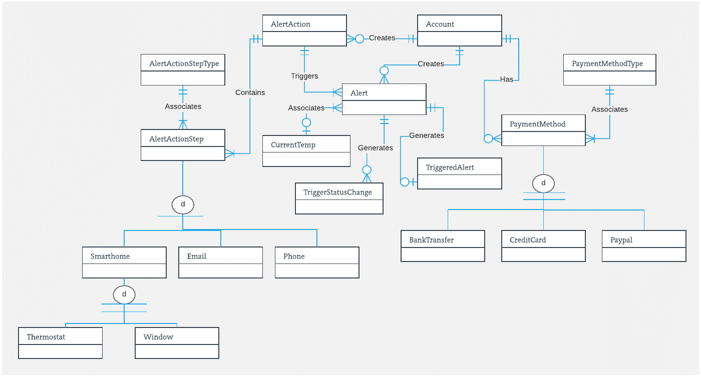
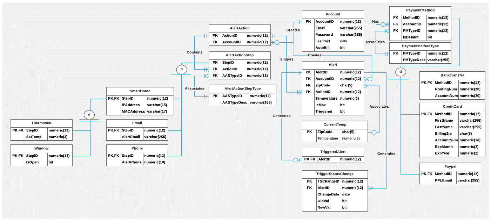

# Smarthome-DB
Series of SQL scripts to create a transactional database for fictional smarthome application, including keys & indexes, stored procedures & triggers implemented in T-SQL, dummy data, and sample queries.

## Conceptual ERD:

## Physical ERD:
